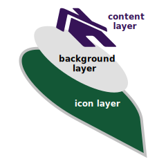

# Leaflet.IconEx

A [Leaflet](https://leafletjs.com/) plugin that creates **the DivIcon with three customizable layers** (as shown in the image).

<p align="center">
  
</p>

* Demo Page: [Leaflet 1 demo](https://mfhsieh.github.io/leaflet-iconex/index.html) or [Leaflet 2 demo](https://mfhsieh.github.io/leaflet-iconex/index_v2.html) (randomly combined icons)
* Current Version: v1.1.2 / v2.0.0-alpha.1 (2026-02-28)
* Tested on desktop and mobile versions of Chrome, Edge, Firefox, and Safari.

## Usage

### Leaflet 1.x (Classic)

Simply include the [JS](dist/leaflet-iconex.min.js) and [CSS](examples/demo.css) in the head.

```html
<head>
    ...
    <script src="dist/leaflet-iconex.min.js"></script>
    <link rel="stylesheet" href="demo.css" />
    ...
</head>
```

Then create an IconEx instance and add it to a marker on the map.

```js
const icon = new L.IconEx({
    contentHtml: `<i class="fas fa-house-user"></i>`,
    iconFill: "#00c",
    contentColor: "#00c",
});
L.marker(latlng, { icon: icon }).addTo(map);
```

### Leaflet 2.x (ESM)

For Leaflet 2.x, use the ESM-ready version [leaflet-iconex_v2.js](dist/leaflet-iconex_v2.min.js).

```js
import L from 'leaflet';
import IconEx from './dist/leaflet-iconex_v2.min.js';

const icon = new IconEx({
    contentHtml: `<i class="fas fa-house-user"></i>`,
    iconFill: "#00c",
    contentColor: "#00c",
});
new L.Marker(latlng, { icon: icon }).addTo(map);
```

For more details, refer to the [Leaflet 1 demo](index.html) or [Leaflet 2 demo](index_v2.html).

## Options

`IconEx` consists of three layers: the bottom is the icon layer, the middle is the background layer, and the top is the content layer.

| Option | Type | Default | Description |
| ---- | ---- | ---- | ---- |
| iconScale | Number | 1 | The scale factor for the entire icon. |
| iconHtml | String | refer to [icon_round.svg](images/icon_round.svg) | The SVG/HTML for the bottom (icon) layer. |
| iconHtmlSize | Number[] | [32, 40] | The [width, height] of the icon layer in pixels. |
| iconHtmlAnchor | Number[] | [16, 40] | The [x, y] anchor point for the icon layer (relative to top-left). |
| iconHtmlPopupAnchor | Number[] | [0, -24] | The [x, y] popup anchor point (relative to the icon anchor). |
| iconFill | String | "#0d6efd" | The CSS fill color for the icon layer. |
| iconOpacity | Number | 1 | The opacity (0 to 1) for the icon layer. |
| iconStroke | String | "#ffffff" | The CSS stroke color for the icon layer. |
| iconStrokeOpacity | Number | 1 | The stroke opacity (0 to 1) for the icon layer. |
| backgroundHtml | String | refer to [icon_round.svg](images/icon_round.svg) | The SVG/HTML for the middle (background) layer. |
| backgroundHtmlSize | Number[] | [24, 24] | The [width, height] of the background layer in pixels. |
| backgroundHtmlAnchor | Number[] | [16, 16] | The [x, y] center point for the background layer. |
| backgroundFill | String | "#ffffff" | The CSS fill color for the background layer. |
| backgroundOpacity | Number | 1 | The opacity (0 to 1) for the background layer. |
| contentHtml | String | "" | The SVG/HTML for the top (content) layer. |
| contentHtmlSize | Number[] | null | The [width, height] of the content layer in pixels. |
| contentHtmlAnchor | Number[] | [16, 16] | The [x, y] center point for the content layer. |
| contentColor | String | null | The CSS text/fill color for the content layer. |
| contentFontSize | Number\|String | 16 | The font size for the content layer. Supports number (px) or string (e.g., "1.2rem"). |

## Where

* Source Code: [Github](https://github.com/mfhsieh/leaflet-iconex)

## Author

* email: mfhsieh at gmail.com
* Github: [Github](https://github.com/mfhsieh/)
